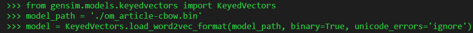
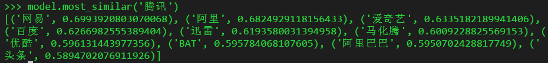
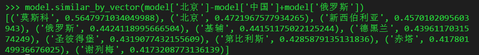

## 文档向量化服务 doc-feature

### 一、项目贡献
1. 基于 [企鹅号](https://om.qq.com) 自媒体发布的 1000 多万篇中文文章语料，利用 CBOW 训练 word2vec 模型，得到 300 维的词向量；
2. 基于 Flask 框架提供一个简单的抽取文档向量的服务；

### 二、模型训练
1. 本次训练使用参数

| 参数名 | 取值 | 
| - | :-: | 
| size | 300 |
| window | 5 |
| min_count | 3 |
| sg | 0 |

2. 参数含义
- size: 指定词向量的维度
- window: 指定句子中当前词语和待预测词语之间的最大距离
- min_count: 指定最小词频，忽略语料中总出现次数低于该值的词语
- sg: 指定训练算法，1 表示 "skip-gram"，0 表示 " CBOW"

3. 使用示例
   1) 设置 locale ，在终端正确输入中文字符， ```export LANG=zh_CN.UTF-8```

   2) 载入 word2vec 模型
     
     
   3) 示例
     
     

### 三、文档向量化服务
1. 在目录 vec_server 中，提供了一个简单的利用 word2vec 抽取文档向量的 HTTP 服务
2. 基于 Flask 框架，只支持 POST 请求：
   - 参数名 ```doc```，输入为英文空格分割的文档词语列表；
   - 响应内容为 JSON 格式，其中```result``` 字段表示 300 维的向量；
3. CURL 请求示例
```sh
curl -XPOST -d 'doc=王丹妮 黑龙江省 绥化市 宝山镇 患有 白血病 年 花 43 万 钱治空 房子 卖 写下 死亡 日记 记录 抗 癌 经历 月 15 号 11 岁 生日 写道 祈求 死神 早日 带走 无钱 医治 真的 太 痛苦 月前 乙图 故事 关注 网友 高度 关注 一位 好心 神秘 人一次 捐赠 22 万 医疗费 图为 回到  北京 治疗 丹妮' 'http://host:ip/vectorize'
```
```json
{"code":0,"cost":0.0004267692565917969,"msg":"success","result":[0.06821354478597641,-0.019527506083250046,0.005196582991629839,-0.007831303402781487,-0.04250103235244751,-0.008324585855007172,0.008452429436147213,0.035722218453884125,-0.009478715248405933,-0.022253381088376045,0.030765678733587265,-0.03207497298717499,0.007590391673147678,-0.026294702664017677,-0.00020198342099320143,0.05925476923584938,-0.01296934299170971,0.014265719801187515,-0.0065751634538173676,0.0515146367251873,-0.01207288634032011,-0.06573884189128876,0.009658833034336567,-0.0301253292709589,-0.038956042379140854,0.03711190074682236,0.0025343734305351973,0.02558995597064495,0.027766743674874306,0.043299149721860886,0.06351080536842346,0.10480470210313797,-0.007878253236413002,0.03932863101363182,0.011315948329865932,0.06989555805921555,-0.002187058562412858,-0.02510301023721695,-0.004791658837348223,0.0018453377997502685,-0.013123556971549988,-0.025869298726320267,0.021751735359430313,-0.013510470278561115,-0.01741030439734459,-0.01196735817939043,-0.031662143766880035,0.0014729257673025131,-0.018083784729242325,-0.0583781898021698,-0.053441110998392105,0.012393911369144917,-0.012974206358194351,-0.07159584015607834,0.01831233501434326,-0.02367870882153511,-0.024166719987988472,-0.050965361297130585,-0.01584147848188877,0.12251166999340057,0.030114494264125824,0.014600493013858795,-0.024212120100855827,0.014059441164135933,-0.029108336195349693,0.07789138704538345,0.009004534222185612,0.0009719950030557811,-0.008058094419538975,-0.05125243216753006,0.02977588027715683,-0.025062447413802147,-0.026353875175118446,0.019954334944486618,0.0234088022261858,-0.015714846551418304,0.012437927536666393,-0.02532857097685337,0.05448174849152565,0.010108580812811852,-0.04470203444361687,0.027049245312809944,0.008568971417844296,0.03288145363330841,0.006183672696352005,-0.0028746575117111206,-0.0375710129737854,0.03863377496600151,0.004503031726926565,-0.005870425142347813,-0.009024014696478844,-0.04757935553789139,-0.019780535250902176,-0.04130643233656883,-0.005708103068172932,0.003390199039131403,0.011234433390200138,-0.006076248362660408,-0.018041566014289856,0.015289831906557083,0.05996878817677498,-0.04101059213280678,-0.012454012408852577,0.013615615665912628,0.011766837909817696,0.04236232861876488,-0.05573583021759987,0.0010717461118474603,-0.08153536915779114,0.010164168663322926,0.043613072484731674,0.06867630034685135,-0.026308098807930946,0.026430457830429077,-0.015454025007784367,-0.0502457320690155,0.05503378435969353,0.07186053693294525,-0.0788474902510643,0.030506616458296776,-0.06503540277481079,0.0003196464676875621,0.01877744309604168,-0.05640089139342308,0.030553461983799934,0.02198229916393757,-0.009830368682742119,0.05703853443264961,-0.032813817262649536,0.00447093416005373,-0.023233037441968918,0.05945071950554848,0.006442520767450333,0.008596114814281464,0.050235748291015625,-0.024356659501791,-0.018187329173088074,-0.057894784957170486,-0.028554953634738922,0.011771260760724545,0.01179135125130415,0.008962627500295639,-0.026415793225169182,0.004824510775506496,-0.014480022713541985,-0.016715576872229576,0.014183064922690392,-0.0008640935411676764,-0.042187854647636414,-0.025485150516033173,0.07373762875795364,-0.012852552346885204,-0.109000563621521,0.009897910989820957,0.04498157650232315,0.034711483865976334,0.0462893508374691,-0.007581401150673628,0.028084976598620415,-0.05432052165269852,0.012963639572262764,-0.013850279152393341,0.026251159608364105,-0.023524323478341103,-0.01269345823675394,0.014133162796497345,0.046768851578235626,-0.00792997982352972,0.07111743837594986,0.04301784560084343,0.020853493362665176,-0.008977782912552357,0.029966825619339943,-0.0006974299903959036,0.019388534128665924,0.07655424624681473,0.013774706050753593,-0.0347776785492897,-0.0310792475938797,-0.003679983550682664,0.0524199903011322,-0.0076713259331882,-0.0163774061948061,0.11320663243532181,0.0008545648888684809,0.030091913416981697,-0.03393552079796791,-0.016573861241340637,-0.010240832343697548,0.024516981095075607,0.002207236597314477,-0.02263478934764862,-0.019072936847805977,-0.025757700204849243,-0.047247663140296936,0.06918121129274368,-0.030962465330958366,-0.0015081878518685699,0.012533437460660934,-0.01600959151983261,0.02642003819346428,0.02175518497824669,-0.04694192856550217,0.008600873872637749,0.0008745022932998836,0.07762569934129715,-0.0420118011534214,-0.03374888002872467,0.026088548824191093,-0.0461842343211174,0.02075161784887314,0.0010345469927415252,0.021691931411623955,-0.056838467717170715,-0.007849935442209244,0.03915700688958168,-0.004691167268902063,-0.03716162592172623,0.03187165781855583,0.050936002284288406,0.0038015993777662516,-0.02802397310733795,-0.06974727660417557,-0.009763742797076702,-0.01690410077571869,0.022200535982847214,-0.009053371846675873,0.04831630364060402,-0.029964923858642578,0.016478151082992554,-0.03131595253944397,-0.055513013154268265,0.031095486134290695,-0.08711457997560501,0.011493655852973461,0.019919222220778465,-0.013740135356783867,0.0305262953042984,0.04765695333480835,-0.016294963657855988,-0.005890298169106245,0.05014277622103691,-0.04997587576508522,-0.015572027303278446,0.015513695776462555,0.05085136368870735,-0.014072692021727562,0.045087337493896484,0.01746457628905773,0.008922798559069633,-0.03868931531906128,-0.057543203234672546,-0.046218130737543106,0.052757520228624344,0.04567980393767357,-0.03821823373436928,-0.011907266452908516,-0.039653461426496506,0.0021324006374925375,0.049167294055223465,-0.06943752616643906,0.02993779256939888,-0.02002946473658085,-0.017417464405298233,-0.04589015245437622,0.053372908383607864,-0.02339383028447628,0.03420304134488106,-0.0033583659678697586,0.020678577944636345,-0.04664349928498268,-0.02907763235270977,-0.005819531157612801,0.11338680982589722,0.002761353040114045,0.025851823389530182,0.00682592811062932,-0.016053827479481697,-0.049780771136283875,-0.03464338555932045,-0.015766046941280365,-0.06616483628749847,0.029632916674017906,0.04496898502111435,-0.05794723331928253,0.05765242502093315,-0.0009790491312742233,0.0012337533989921212,-0.035053130239248276,-0.03936746343970299,0.017650937661528587,-0.06669051945209503,-0.02653873898088932,-0.05222805589437485,-0.07361788302659988,0.020585812628269196,-0.04453787952661514,0.028112927451729774,-0.004388514440506697,0.021621063351631165]}
```

### 四、参考
1. [word2vec 模型微云下载](https://share.weiyun.com/5MMqj97)
2. [gensim.models.word2vec.Word2Vec 类说明文档](https://radimrehurek.com/gensim/models/word2vec.html#gensim.models.word2vec.Word2Vec)
